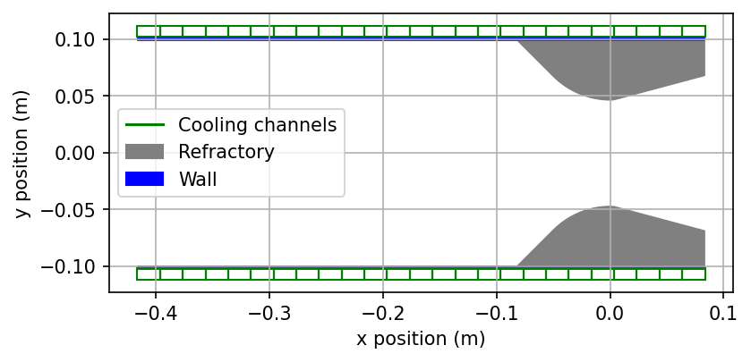

	
	<h1 align="center">BAMBOO</h1>
	<h3 align="center">Cambridge University Spaceflight</h3>

Bamboo is a Python tool that provides functions and classes for modelling the cooling systems of liquid rocket engines. Alongside this, it contains a range of other miscellaneous tools to aid with general engine design.

An introduction to the package can be found in the 'Introduction to Bamboo.ipynb' Jupyter Notebook.

## Installation
`pip install git+https://github.com/cuspaceflight/bamboo.git`

## General engine tools available
- Nozzle shape calculator for Rao bell nozzles.
- Get thrust and specific impulse.
- Get gas properties (temperature and pressure) as a function of position in the nozzle.
- Estimate apogee using a simple 1D trajectory simulator.
- Optimise nozzle area ratio based on the simple trajectory simulator.

## Tools for cooling system modelling
- Add a regenerative cooling jacket to the engine.
- Add a refractory (e.g. a graphite insert) into the engine.
- Specify your own coolant and exhaust gas transport properties.
- Steady state heating simulations for cooling jackets on their own, or cooling jackets with refractories.
- Transient and steady state stress analysis tools.

## Incomplete
- Ablative cooling system modelling.
- Time dependent cooling analysis.

## Documentation
(may be outdated)

Made using Sphinx, available at: 
https://cuspaceflight.github.io/bamboo/

## Examples plots
An example engine setup, using copper walls (blue) with a graphite nozzle insert (grey), and a spiralling regenerative cooling channel (green). The coolant travels into and out of the page.

	

Some corresponding data from a steady state heating analysis (ablation is ignored, the graphite acts as a refractory), showing the copper wall temperatures and coolant temperatures against x position:

	

